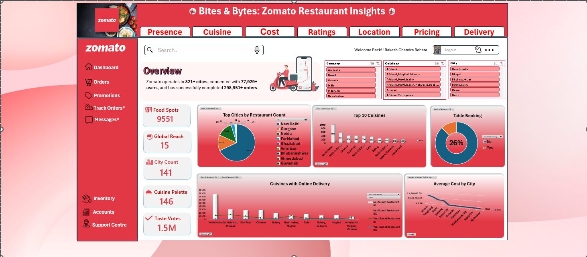

# 📊 Zomato Restaurant Analytics Dashboard  
**Excel | Data Analysis | Business Insights**

---

## 🔍 Overview  
This project analyzes Zomato restaurant data to uncover **market trends, customer behavior, and pricing patterns** using Excel.

The goal was to transform raw data into a **clean, interactive dashboard** that supports data-driven decisions.

---

## 🎯 Key Objectives  
- Analyze restaurant distribution across cities & localities  
- Identify popular cuisines and demand patterns  
- Study pricing trends and cost distribution  
- Evaluate ratings, votes, and customer engagement  
- Compare delivery vs non-delivery restaurant performance  

---

## 📊 Dashboard Preview  

---

## 🧠 Key Insights  

### 📍 Market Distribution  
- Metro cities dominate restaurant listings → strong urban demand  
- Food hubs like Connaught Place & Koramangala show high density  

### 🍜 Cuisine Trends  
- North Indian, Chinese, and Fast Food dominate listings  
- Premium cuisines (Italian, Continental) → higher ratings  

### 💰 Pricing Patterns  
- Majority restaurants fall under budget & mid-range  
- Higher price range → better ratings & premium experience  

### ⭐ Customer Behavior  
- Avg rating: ~3.8–4.0  
- Delivery restaurants → more votes & engagement  

### 🚚 Delivery Trends  
- Delivery-enabled restaurants dominate the platform  
- Mid-range pricing + delivery = highest demand segment  

---

## 🛠 Tools & Techniques  
- Microsoft Excel  
- Pivot Tables & Charts  
- Slicers (interactive filters)  
- Data Cleaning & Transformation  
- Dashboard Design  

---

## ⚙️ Workflow  
1. Data Cleaning (nulls, formatting, duplicates)  
2. Data Preparation (type conversion, feature creation)  
3. Analysis using Pivot Tables  
4. Dashboard creation with slicers & KPIs  

---

## 📁 Project Files  
- Excel Dashboard (.xlsx)  
- Dataset  
- Dashboard Screenshot  

---

## 👤 Author  
**Rakesh Chandra Behera**  
Aspiring Data Analyst | Excel • SQL • Python • Data Visualization 

---

